# Lunara Application - Master System Architecture & Technical Specifications

> **System Overview**: Lunara is an enterprise-grade social nightlife, event booking, party planning, and strangers-meet matchmaking platform. It features a Flutter cross-platform mobile/web frontend and a Node.js / Express / TypeScript backend powered by PostgreSQL, Socket.io, Firebase Cloud Messaging (FCM), Razorpay Payments, and Azure Cloud Infrastructure.

---

## 1. Executive Architecture Summary

Lunara is built as a micro-service-ready modular monolith operating on a **Node.js Express TypeScript** backend and a **Flutter Cross-Platform (iOS/Android/Web)** frontend. Real-time events, messaging, and notifications run over a dual-channel architecture: high-frequency real-time updates use **Socket.io WebSockets**, while background out-of-app alerts use **Firebase Cloud Messaging (FCM)**.

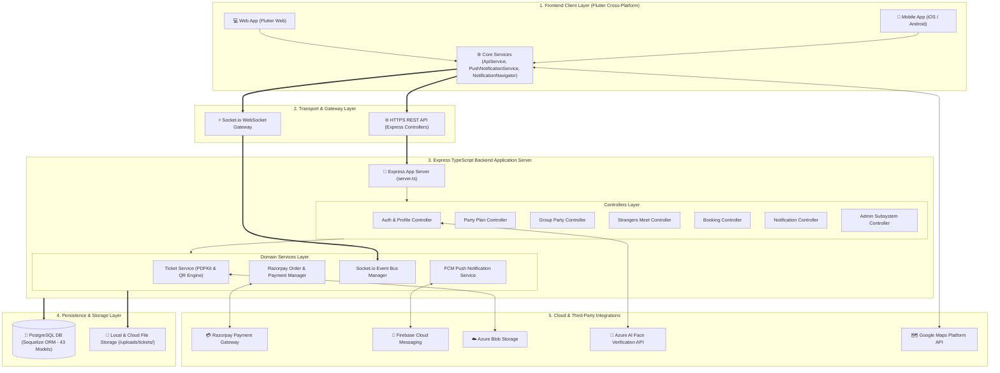

---

## 2. Complete Database Entity-Relationship Diagram (ERD)

The database consists of **43 Sequelize Models** managed in PostgreSQL with strict data isolation, foreign key constraints, and index optimization.

```mermaid
erDiagram
    User ||--o{ UserProfile : "has"
    User ||--o{ UserPhoto : "has photos"
    User ||--o{ UserPreference : "has preferences"
    User ||--o{ PartyPlan : "hosts"
    User ||--o{ PartyPlanRequest : "requests join"
    User ||--o{ GroupParty : "creates"
    User ||--o{ StrangersMeetRequest : "hosts"
    User ||--o{ StrangersMeetJoiner : "joins"
    User ||--o{ Booking : "makes"
    User ||--o{ Payment : "transacts"
    User ||--o{ UserMatch : "matches with"
    User ||--o{ Conversation : "participates in"
    User ||--o{ UserSubscription : "subscribes"
    User ||--o{ SafetyCheck : "submits"

    Venue ||--o{ VenueImage : "has images"
    Venue ||--o{ PartyPlan : "hosts"
    Venue ||--o{ GroupParty : "hosts"
    Venue ||--o{ StrangersMeetRequest : "hosts"
    Venue ||--o{ Booking : "reserved at"

    PartyPlan ||--o{ PartyPlanRequest : "receives requests"
    StrangersMeetRequest ||--o{ StrangersMeetJoiner : "receives joiners"
    Conversation ||--o{ Message : "contains"

    User {
        uuid id PK
        string firstName
        string lastName
        string username UK
        string email UK
        string mobileNumber UK
        string profileImageUrl
        string fcmToken
        string subscriptionTier
        boolean isVerified
        timestamp clearedNotificationsAt
    }

    Venue {
        uuid id PK
        string name
        string addressLine1
        string area
        string city
        decimal groupPartyChargePerPerson
        decimal tableBookingCharges
        float latitude
        float longitude
    }

    Booking {
        uuid id PK
        uuid userId FK
        uuid venueId FK
        string goingMode "party_request | solo"
        string status "pending | confirmed | cancelled | completed"
        string paymentStatus "unpaid | paid | refunded"
        string ticketCode "PP-XXXXXX | GP-XXXXXX | SM-XXXXXX"
        string ticketUrl
        json specialRequests "Metadata (planId, requestId, hostId, joinerId)"
    }

    PartyPlan {
        uuid id PK
        uuid userId FK
        uuid venueId FK
        timestamp planDateTime
        string depositAmount
        string status "active | matched | completed"
    }

    PartyPlanRequest {
        uuid id PK
        uuid planId FK
        uuid requesterId FK
        string status "pending | accepted | rejected"
        string joinerPaymentStatus "unpaid | paid"
        string ticketCode
        string ticketUrl
    }

    GroupParty {
        uuid id PK
        uuid userId FK
        uuid venueId FK
        integer numberOfFriends
        decimal totalAmount
        string status "pending | approved | confirmed"
        string paymentStatus "pending | paid"
        string ticketCode
        string ticketUrl
    }

    StrangersMeetRequest {
        uuid id PK
        uuid userId FK
        uuid venueId FK
        string subject
        string tagline
        timestamp eventDateTime
        integer numberOfPersons
        decimal chargesPerHead
        string status "pending | approved | completed"
        string paymentStatus "unpaid | paid"
        string ticketId
        string ticketUrl
    }

    Payment {
        uuid id PK
        uuid userId FK
        string razorpayOrderId UK
        string razorpayPaymentId UK
        decimal amount
        string status "created | captured | failed"
    }

    UserMatch {
        uuid id PK
        uuid userId FK
        uuid matchedUserId FK
        boolean isSuperLike
        string status "pending | matched | rejected"
    }
```

---

## 3. End-to-End Subsystem Flowcharts

### 3.1 Party Plan Subsystem Flow (Host + Partner)

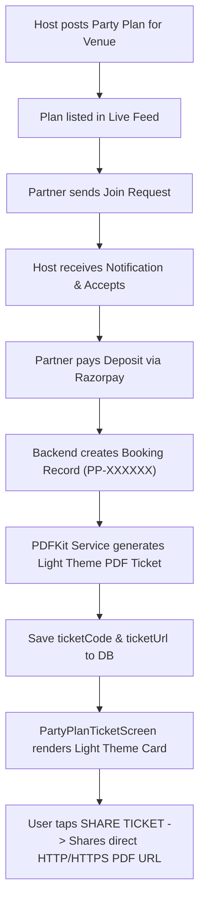

---

### 3.2 Group Party Subsystem Flow (Small <20 & Large >=20 Guests)

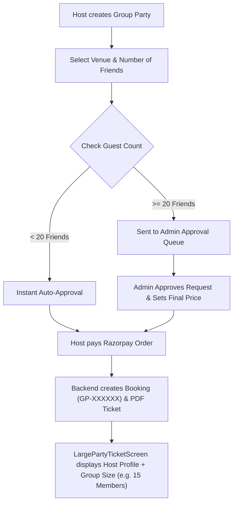

---

### 3.3 Strangers Meet Subsystem Flow (21–50 Persons)

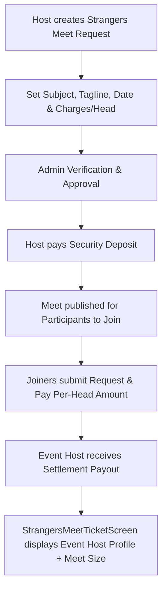

---

### 3.4 Real-Time Notification & Top Floating Banner Subsystem Flow

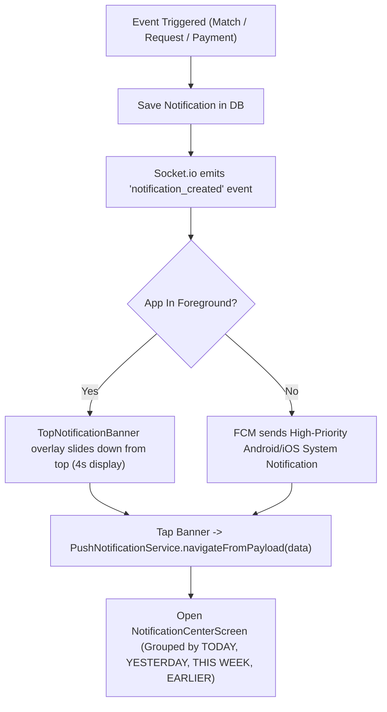

---

## 4. Sequence Diagrams

### 4.1 On-The-Fly PDF Ticket Persistence Sequence

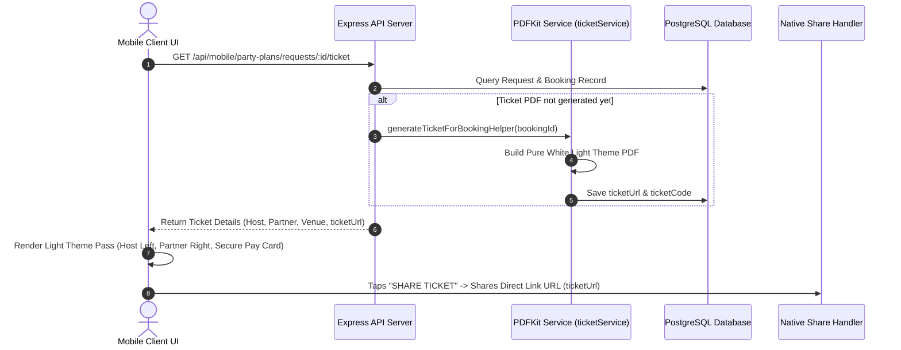

---

### 4.2 Real-Time Chat & Notification Sequence

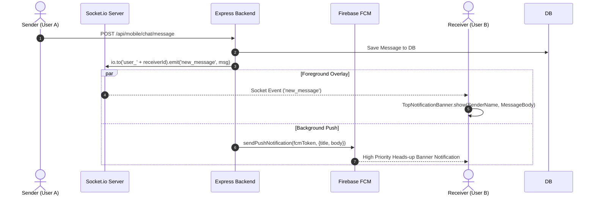

---

## 5. Security & Azure AI Biometric Authentication

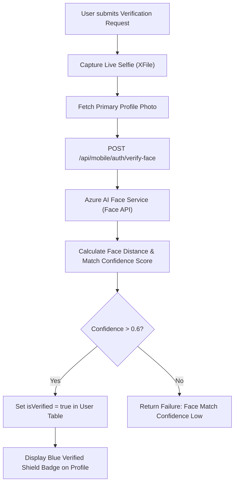

---

## 6. Frontend Component Architecture (Flutter)

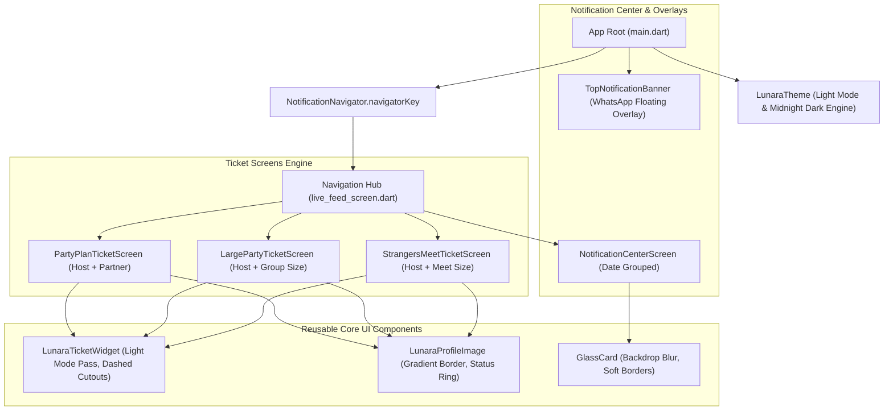

---

## 7. Backend Directory & Layered Architecture

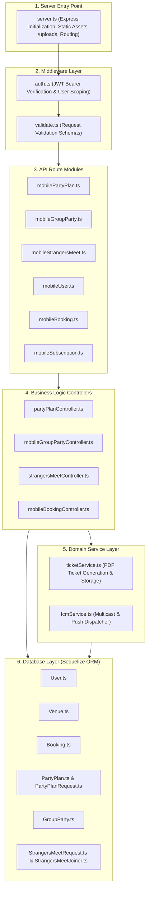

---

## 8. Complete REST API Routing Matrix

| Route Path | Method | Controller Handler | Purpose |
| :--- | :--- | :--- | :--- |
| `/api/mobile/auth/login` | `POST` | `mobileAuth.ts` | Mobile Phone OTP & JWT Auth Login |
| `/api/mobile/auth/verify-face` | `POST` | `mobileAuth.ts` | Azure AI Face Biometric Verification |
| `/api/mobile/user/userprofile` | `GET` | `mobileUser.ts` | Fetch Current User Profile Details |
| `/api/mobile/user/notifications` | `GET` | `mobileUser.ts` | Real-time Compiled Notifications (Date Grouped) |
| `/api/mobile/user/notifications/:id/read` | `PATCH` | `mobileUser.ts` | Mark Notification as Read |
| `/api/mobile/user/notifications/clear-all` | `POST` | `mobileUser.ts` | Clear All Notifications for User |
| `/api/mobile/party-plans` | `POST` | `partyPlanController.ts` | Host Creates Party Plan for Venue |
| `/api/mobile/party-plans/requests/:id/ticket` | `GET` | `partyPlanController.ts` | Fetch Party Plan Ticket Data & Generate PDF |
| `/api/mobile/group-parties` | `POST` | `mobileGroupPartyController.ts` | Create Group Party (<20 or >=20 Friends) |
| `/api/mobile/group-parties/:id/ticket` | `GET` | `mobileGroupPartyController.ts` | Fetch Group Party Ticket (Single Host + Size) |
| `/api/mobile/strangers-meet/requests` | `POST` | `strangersMeetController.ts` | Host Submits Strangers Meet Event |
| `/api/mobile/strangers-meet/requests/:id/ticket` | `GET` | `strangersMeetController.ts` | Fetch Strangers Meet Ticket (Host + Meet Size) |
| `/api/mobile/bookings` | `GET` | `mobileBookingController.ts` | Fetch All Confirmed & Pending Bookings |

---

## 9. Production Deployment Infrastructure Blueprint

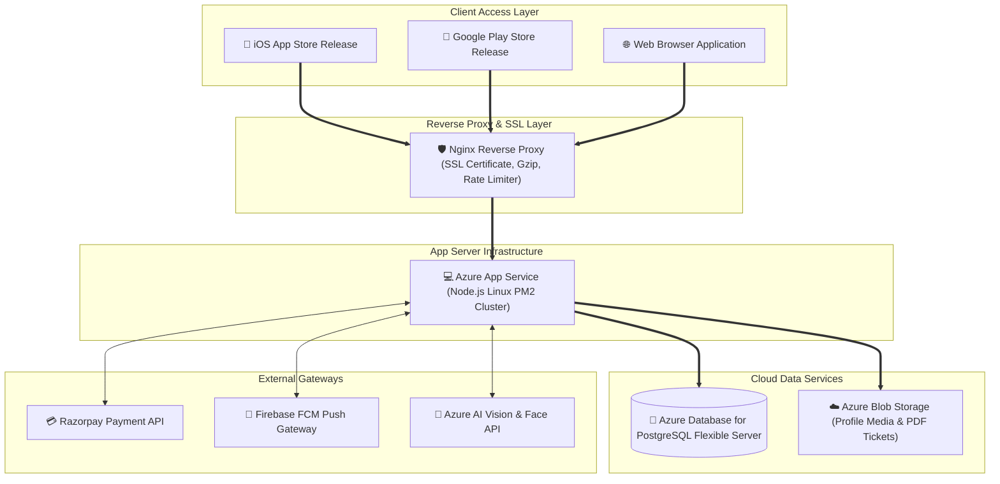

---

## 10. Key Specifications Summary

| System Aspect | Implementation Specification |
| :--- | :--- |
| **Frontend Framework** | Flutter Cross-Platform (iOS, Android, Web) with Light Theme Ticket System (`#F6F7FB`) & Dark Theme Shell (`#0B0914`). |
| **Backend Framework** | Node.js, Express, TypeScript, REST API, WebSockets (Socket.io). |
| **Database Engine** | PostgreSQL with Sequelize ORM (43 Entities, FK Constraints, Indexing). |
| **Real-Time System** | Dual-channel: Socket.io for active app foreground session, FCM for background OS push notifications. |
| **Ticket System** | On-the-fly PDF generation (`PDFKit`), DB persistence (`ticketCode`, `ticketUrl`), direct URL link sharing. |
| **Biometric Security** | Azure AI Face Service verification matching selfie vs profile image with >0.6 confidence. |
